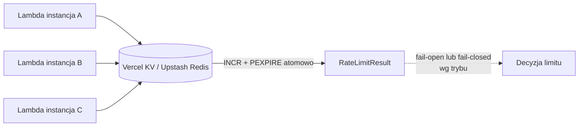
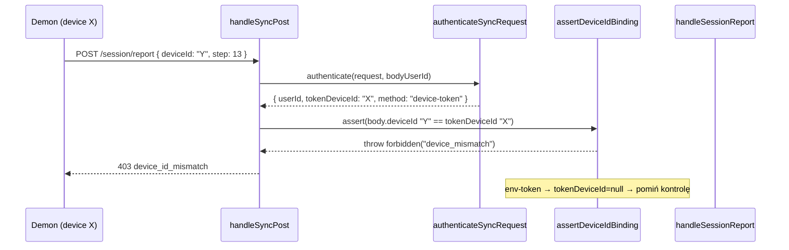

# Dokument projektowy: Plan poprawek warstwy synchronizacji online (`online-sync-remediation`)

## Overview

Ten dokument projektuje remediację ustaleń z audytu bezpieczeństwa i logiki
(`audyt_synchronizacji_online_2026-07-01.md`) dla warstwy synchronizacji online
projektu `__cfab_server` (Next.js App Router + Prisma/Postgres + SFTP/FTP/S3,
deploy serverless na Vercel, region `iad1`). Celem jest naprawa trzech ustaleń
krytycznych (fałszywy model E2E, nieskuteczny rate limiting na serverless,
nieuwierzytelnione `deviceId`), pięciu ustaleń średnich oraz zestawu hardeningu,
przy zachowaniu kompatybilności wstecznej z klientem-demonem (`__cfab_demon`).

Poprawki są pogrupowane w **workstreamy (WS)** o narastającym ryzyku i koszcie.
Kolejność wdrożenia trzyma się priorytetów audytu: najpierw szybkie i lokalne
(WS-A: JSON + throttle), następnie związanie tożsamości urządzenia (WS-B: `deviceId`),
potem infrastruktura współdzielona (WS-C: rate limiter + IP), a na końcu zmiana
architektoniczna E2E (WS-D). Hardening (WS-E) i poprawka logiki dedup (WS-F)
idą równolegle jako zadania niezależne.

Dwa tory synchronizacji, których dotyczy plan:

- **Session sync + Async-delta** — aktywny model produkcyjny; serwer pośredniczy
  w metadanych i kredencjałach storage, dane lecą przez FTP/SFTP/S3 zaszyfrowane
  po stronie klienta.
- **Direct-sync** — starszy tor (snapshot w Postgres), domyślnie zablokowany w
  produkcji przez `legacy-gate.ts` (odpowiedź 410). Dotyczy go wyłącznie poprawka
  logiki dedup (WS-F) oraz wspólne mechanizmy (JSON, rate limit, IP).

---

## Architecture

### Mapa workstreamów do ustaleń audytu

| WS | Zakres | Ustalenia | Waga | Ryzyko wdrożenia |
|----|--------|-----------|------|------------------|
| WS-A | Walidacja strukturalna JSON + wire throttling | #5, #6 | Średnia | Niskie (lokalne) |
| WS-B | Związanie `deviceId` z tokenem urządzenia | #3 | Krytyczna | Średnie (kontrakt API) |
| WS-C | Współdzielony rate limiter + zaufany parsing IP | #2, #4 | Krytyczna/Średnia | Średnie (nowa zależność) |
| WS-D | Realny model E2E z sekretem klienta | #1, #9 | Krytyczna | Wysokie (architektura + migracja demona) |
| WS-E | Hardening | #7, #8, #10, #11, #12 | Niska | Niskie |
| WS-F | Poprawność dedup delta | logika | — | Niskie |

### Model zaufania: stan obecny vs docelowy

```mermaid
graph TD
    subgraph Obecny["Model obecny (podatny)"]
        C1[Klient/demon] -->|Bearer device token| A1[authenticateSyncRequest]
        A1 -->|userId = group.ownerId<br/>deviceId z tokenu PORZUCONY| H1[Handlery]
        H1 -->|ufa body.deviceId| S1[Sesje / async-delta]
        A1 -.->|klucz = SHA-256 groupId| K1[deriveGroupKey]
        K1 -.->|serwer zna hasło SFTP| E1[Pozorny E2E]
    end

    subgraph Docelowy["Model docelowy (utwardzony)"]
        C2[Klient/demon] -->|Bearer device token| A2[authenticateSyncRequest]
        A2 -->|userId + tokenDeviceId| H2[Handlery]
        H2 -->|assertDeviceIdBinding| S2[Sesje / async-delta]
        A2 -.->|klucz zawiera sekret klienta| K2[E2E v2 KDF]
        K2 -.->|serwer NIE zna passphrase| E2[Realny E2E]
    end
```



### Współdzielony rate limiter — architektura docelowa



### Sekwencja: związanie `deviceId` (WS-B) na przykładzie `session-report`



### Sekwencja: model E2E v2 (WS-D)

```mermaid
sequenceDiagram
    participant D1 as Demon A (ma passphrase P)
    participant SRV as Serwer
    participant ST as Storage (SFTP/S3)
    participant D2 as Demon B (ma passphrase P)

    Note over D1,D2: P = passphrase grupy, NIGDY nie trafia na serwer
    D1->>SRV: async/push (metadane, markery)
    SRV->>ST: utwórz katalog paczki
    SRV-->>D1: storageCredentials zaszyfrowane KEK = KDF(P, groupId, salt)
    D1->>D1: odszyfruj creds passphrase P
    D1->>ST: upload delta.enc (klucz plików = KDF(P, packageId))
    D2->>SRV: async/pending + async/credentials
    SRV-->>D2: te same zaszyfrowane creds
    D2->>D2: odszyfruj creds passphrase P
    D2->>ST: pobierz + odszyfruj delta.enc
    Note over SRV: serwer widzi tylko szyfrogram creds; bez P nie zna haseł storage
```

---

## Components and Interfaces

### WS-A — Walidacja strukturalna JSON

**Komponent:** `src/lib/http/json-guard.ts` (nowy), wpięty w `parseJsonBody`
(`request.ts`).

**Cel:** egzekwować `syncMaxArrayItems`, `syncMaxObjectKeys`, `syncMaxJsonDepth`
(zdefiniowane w `env.ts`, dziś martwe). Zapobiega DoS przez ogromne tablice
mieszczące się w budżecie 20 MB.

**Interfejs:**

```typescript
export interface JsonStructureLimits {
  maxArrayItems: number;
  maxObjectKeys: number;
  maxDepth: number;
}

/**
 * Waliduje sparsowaną wartość JSON wobec limitów strukturalnych.
 * Rzuca AppError (400 payload_structure_exceeded) przy naruszeniu.
 * Iteracyjny obchód (jawny stos) — bez rekurencji, by nie przepełnić
 * stosu na wrogim głębokim wejściu.
 */
export function assertJsonStructure(
  value: unknown,
  limits: JsonStructureLimits,
): void;
```

**Odpowiedzialności:**
- Obejść cały graf wartości iteracyjnie (jawny stos), zliczając głębokość.
- Odrzucić tablicę z liczbą elementów > `maxArrayItems`.
- Odrzucić obiekt z liczbą kluczy > `maxObjectKeys`.
- Odrzucić zagnieżdżenie > `maxDepth`.

### WS-A — Wire throttling (naprawa martwego kodu)

**Komponent:** `resolveLicenseContext` w `session-service.ts`.

**Cel:** realnie odczytać `DeviceRegistration` (z `lastSyncAt`), aby
`validateLicenseForSync` mógł wyzwolić gałąź `maxSyncFrequencyHours`.

**Interfejs (zmiana istniejącej funkcji):**

```typescript
// Dziś: device zawsze null → throttle nieaktywny.
// Docelowo: realny odczyt urządzenia po deviceId.
async function resolveLicenseContext(
  userId: string,
  deviceId: string,       // NOWY parametr
): Promise<UserLicenseContext | null>;
```

### WS-B — Związanie `deviceId`

**Komponent:** `server-auth.ts` (rozszerzenie `SyncAuthContext`) + nowy helper
`assertDeviceIdBinding`, wpięty w `handleSyncPost` / `handleSyncGet` (`http.ts`).

**Cel:** token urządzenia niesie tożsamość `deviceId`; `body.deviceId` musi się
z nią zgadzać. Dla env-tokenów (`method: "token"`) tożsamość urządzenia nie
istnieje — kontrola jest pomijana (zachowanie bez zmian).

**Interfejs:**

```typescript
export interface SyncAuthContext {
  userId: string;
  method: "token" | "device-token" | "dev-body-userid";
  tokenDeviceId: string | null; // NOWE: deviceId z tokenu urządzenia, lub null dla env-token
}

/**
 * Egzekwuje spójność body.deviceId z tożsamością tokenu.
 * - device-token: body.deviceId MUSI == tokenDeviceId, inaczej 403.
 * - token/dev-body-userid: tokenDeviceId == null → pomiń (env-token operuje
 *   w imieniu właściciela grupy, może adresować dowolne urządzenie).
 */
export function assertDeviceIdBinding(
  auth: SyncAuthContext,
  bodyDeviceId: string | null | undefined,
): void;
```

### WS-C — Współdzielony rate limiter

**Komponent:** `src/lib/security/rate-limit.ts` (przepisany na backend
współdzielony) + adapter `src/lib/security/rate-limit-store.ts` (nowy).

**Cel:** limity globalne (per user+IP+route) skuteczne na serverless — jedno
źródło prawdy w Vercel KV / Upstash Redis, atomowe `INCR`+`PEXPIRE`.

**Interfejs (zachowany kontrakt wyniku, funkcja staje się async):**

```typescript
export interface RateLimitResult {
  allowed: boolean;
  limit: number;
  remaining: number;
  resetAt: number;
  retryAfterMs: number;
}

/** Backend limitera — abstrakcja pozwalająca testować i podmieniać store. */
export interface RateLimitStore {
  /** Atomowo inkrementuje licznik okna i zwraca aktualny stan. */
  incr(key: string, windowMs: number): Promise<{ count: number; resetAt: number }>;
}

/** Async: sięga do współdzielonego store (KV/Redis). */
export async function checkRateLimit(
  key: string,
  limit: number,
  windowMs: number,
): Promise<RateLimitResult>;
```

### WS-C — Zaufany parsing IP

**Komponent:** `getClientIp` w `request.ts`.

**Cel:** nie ufać sterowanemu przez klienta *pierwszemu* wpisowi `X-Forwarded-For`.
Na Vercelu ufać wyłącznie zaufanemu hopowi platformy.

**Interfejs (zmiana implementacji, sygnatura bez zmian):**

```typescript
/**
 * Zwraca IP klienta z zaufanego źródła platformy.
 * Priorytet: nagłówek platformy (Vercel: x-real-ip / x-vercel-forwarded-for)
 * → ostatni (najbardziej prawy, dodany przez zaufane proxy) wpis XFF
 * → null. NIGDY nie bierze lewego, sterowanego przez klienta wpisu XFF.
 */
export function getClientIp(request: Request): string | null;
```

### WS-D — Realny model E2E (opcje w sekcji "Decyzje architektoniczne")

**Komponent:** `storage-encryption.ts` (nowa ścieżka KDF v2) + kontrakty
`session-contracts.ts` + demon `online-sync.ts`.

**Interfejs docelowy:**

```typescript
/**
 * E2E v2: klucz pochodzi z sekretu klienta (passphrase grupy) — serwer go nie zna.
 * Zamiast SHA-256(domain|groupId) używamy HKDF/scrypt(passphrase, salt=groupId, info=domain-v2).
 * groupId pełni rolę soli/kontekstu, NIE jedynego materiału klucza.
 */
export function deriveGroupKeyV2(
  passphrase: string,   // sekret znany tylko klientom
  groupId: string,      // sól/kontekst
): string;

/** Wersjonowanie schematu na potrzeby migracji i współistnienia v1/v2. */
export type E2eKeyScheme = "v1-groupid" | "v2-passphrase";
```

**Uwaga architektoniczna:** w modelu docelowym serwer **nie generuje** haseł
storage w plaintext do wglądu klienta w sposób odwracalny bez sekretu. Opcje
redukcji wiedzy serwera o kredencjałach opisano niżej.

### WS-E — Hardening

- **Cookie panelu (#7):** `dashboard-page-auth.ts` — podpisany, krótkotrwały
  sekret sesji zamiast surowego tokenu API.
- **CORS (#8):** `http.ts` / route'y licencji — nie zwracać `*` na sztywno;
  respektować `syncAllowedOrigins`.
- **mapInfraError (#10):** `http.ts` — nie ujawniać `prismaCode` klientowi
  (logować po stronie serwera, klientowi zwracać sam `code`).
- **Marker mismatch (#11):** `session-service.ts` — twarde `failed` zamiast
  soft-warning przy rozbieżnych markerach w kroku 12.
- **Admin-auth (#12):** `admin-auth.ts` — usunąć gałąź `length` przed
  `timingSafeEqual` (stałoczasowe porównanie na paddowanym buforze).

### WS-F — Poprawność dedup delta

**Komponent:** `direct-sync.ts` (merge `assignment_feedback` /
`assignment_auto_runs`).

**Cel:** przestać scalać/gubić różne, ale równoczasowe rekordy dedupowane po
`source|created_at` / `started_at`. Rozszerzyć klucz naturalny o pełny zestaw
pól tożsamości rekordu (patrz pseudokod).

---

## Data Models

(zmiany Prisma)

Większość WS jest bezschematowa. Zmiany schematu dotyczą wyłącznie WS-D (E2E v2)
oraz opcjonalnie WS-E (cookie panelu). Wszystkie zmiany są **addytywne**
(nowe, nullowalne kolumny) — bez destrukcyjnych migracji, kompatybilne z
istniejącymi wierszami i starym demonem.

### WS-D: znacznik schematu klucza na paczce/sesji

```prisma
model AsyncDeltaPackage {
  // ... istniejące pola ...
  keyScheme  String  @default("v1-groupid") @map("key_scheme") // "v1-groupid" | "v2-passphrase"
  keySalt    String? @map("key_salt")   // base64 soli KDF (v2); null dla v1
}

model SyncSession {
  // ... istniejące pola ...
  keyScheme  String  @default("v1-groupid") @map("key_scheme")
  keySalt    String? @map("key_salt")
}
```

**Uzasadnienie:** pozwala v1 i v2 współistnieć w okresie migracji. Serwer szyfruje
creds schematem zadeklarowanym przez klienta w żądaniu `async/push`; klient
odbierający wie z metadanych paczki, którego schematu użyć do deszyfracji.

### WS-D opcja C (redukcja wiedzy serwera o hasłach storage)

```prisma
model Group {
  // ... istniejące pola ...
  // Zaszyfrowane po stronie KLIENTA creds storage (serwer przechowuje szyfrogram,
  // nie zna hasła). Wypełniane tylko w modelu "bring-your-own-storage".
  clientEncryptedStorageConfig Json? @map("client_encrypted_storage_config")
}
```

### WS-E: sekret sesji panelu (opcja z persystencją)

Preferowane rozwiązanie stateless (podpis HMAC, bez tabeli). Jeśli wymagana jest
unieważnialność sesji panelu, dochodzi tabela:

```prisma
model DashboardSession {
  id         String   @id @default(cuid())
  userId     String   @map("user_id")
  tokenHash  String   @unique @map("token_hash") // SHA-256 losowego sekretu sesji
  createdAt  DateTime @default(now()) @map("created_at")
  expiresAt  DateTime @map("expires_at")

  @@index([userId], map: "dashboard_sessions_user_id_idx")
  @@map("dashboard_sessions")
}
```

**Reguły walidacji modeli:**
- `keyScheme` ∈ {`v1-groupid`, `v2-passphrase`}; inne wartości → odrzucenie żądania.
- `keySalt` wymagane, gdy `keyScheme = v2-passphrase`; MUSI być null dla v1.
- `DashboardSession.expiresAt` ≤ `createdAt + 8h` (krótkotrwałość).

---

## Pseudokod algorytmiczny i specyfikacje formalne

### WS-A.1 — `assertJsonStructure`

```typescript
function assertJsonStructure(value: unknown, limits: JsonStructureLimits): void
```

**Preconditions:**
- `value` to już sparsowany JSON (wynik `JSON.parse`), dowolny kształt.
- `limits.maxArrayItems`, `maxObjectKeys`, `maxDepth` to dodatnie liczby całkowite.

**Postconditions:**
- Zwraca `void` wtw. cały graf spełnia wszystkie trzy limity.
- Rzuca `badRequest(..., "payload_structure_exceeded")` przy pierwszym naruszeniu.
- Brak mutacji `value`.

**Loop invariants:** w każdym kroku obchodu `stack` zawiera wyłącznie węzły o
głębokości ≤ `maxDepth` (naruszenie głębokości jest wykrywane przy próbie
odłożenia dziecka, przed jego przetworzeniem).

```pascal
ALGORITHM assertJsonStructure(value, limits)
BEGIN
  stack ← [ { node: value, depth: 1 } ]

  WHILE stack NOT empty DO
    { node, depth } ← stack.pop()

    IF depth > limits.maxDepth THEN
      THROW badRequest("JSON zbyt głęboki", "payload_structure_exceeded")
    END IF

    IF isArray(node) THEN
      IF length(node) > limits.maxArrayItems THEN
        THROW badRequest("Tablica przekracza limit", "payload_structure_exceeded")
      END IF
      FOR each child IN node DO
        IF isContainer(child) THEN stack.push({ node: child, depth: depth + 1 }) END IF
      END FOR

    ELSE IF isObject(node) THEN
      keys ← ownKeys(node)
      IF length(keys) > limits.maxObjectKeys THEN
        THROW badRequest("Obiekt przekracza limit kluczy", "payload_structure_exceeded")
      END IF
      FOR each k IN keys DO
        child ← node[k]
        IF isContainer(child) THEN stack.push({ node: child, depth: depth + 1 }) END IF
      END FOR
    END IF
    // wartości skalarne (string/number/bool/null) nie wymagają dalszej walidacji
  END WHILE
END
```

**Wpięcie w `parseJsonBody`:** po udanym `JSON.parse` (obie ścieżki: gzip i
uncompressed), przed zwrotem `{ body, ... }`, wywołać `assertJsonStructure(parsed,
{ maxArrayItems: env.syncMaxArrayItems, maxObjectKeys: env.syncMaxObjectKeys,
maxDepth: env.syncMaxJsonDepth })`.

### WS-A.2 — Naprawa throttlingu (`resolveLicenseContext`)

```typescript
async function resolveLicenseContext(userId, deviceId): Promise<UserLicenseContext | null>
```

**Preconditions:** `deviceId` to identyfikator z ciała żądania, już związany z
tokenem (po WS-B).

**Postconditions:** `device` jest realnym `DeviceRegistration` z prawdziwym
`lastSyncAt`, jeśli urządzenie istnieje w store; inaczej `null` (pierwszy sync).

```pascal
ALGORITHM resolveLicenseContext(userId, deviceId)
BEGIN
  group ← findGroupByOwner(userId)
  IF group = NULL THEN RETURN NULL END IF
  license ← findLicense(group.licenseId)
  IF license = NULL THEN RETURN NULL END IF

  // BYŁO: device ← null (throttle martwy). JEST: realny odczyt.
  device ← getDevice(deviceId)   // z license-store (LicenseDevice)

  RETURN { license, group, device }
END
```

Dodatkowo w `handleSessionCreate`: po sukcesie sync zaktualizować
`device.lastSyncAt` (aby kolejne wywołania widziały świeży znacznik). Aktualizacja
przez `updateDeviceLastSync` w warstwie license-store.

### WS-B — `assertDeviceIdBinding` + rozszerzenie auth

```typescript
async function authenticateSyncRequest(request, bodyUserId?): Promise<SyncAuthContext>
```

**Postconditions:** dla `method="device-token"`, `tokenDeviceId` = `deviceId`
zwrócony przez `findDeviceByToken`; dla `method="token"|"dev-body-userid"`,
`tokenDeviceId = null`.

```pascal
ALGORITHM resolveUserByDeviceToken(token)
BEGIN
  result ← findDeviceByToken(token)
  IF result = NULL THEN RETURN NULL END IF
  RETURN { userId: result.group.ownerId, deviceId: result.device.deviceId }
END

ALGORITHM assertDeviceIdBinding(auth, bodyDeviceId)
BEGIN
  IF auth.tokenDeviceId = NULL THEN
    RETURN            // env-token: brak tożsamości urządzenia, pomiń (bez zmian)
  END IF
  IF bodyDeviceId = NULL OR bodyDeviceId ≠ auth.tokenDeviceId THEN
    THROW forbidden("Body deviceId nie zgadza się z tokenem", "device_id_mismatch")
  END IF
END
```

**Wpięcie:** w `handleSyncPost`, tuż po `authenticateSyncRequest`, przed
`checkRateLimit` i `execute`:

```typescript
const auth = await authenticateSyncRequest(request, bodyUserId);
assertDeviceIdBinding(auth, spec.getDeviceId(body));
```

Dla `handleSyncGet` (np. `async/credentials`, `async/pending`) — analogicznie,
gdy trasa przyjmuje `deviceId` w query: `assertDeviceIdBinding(auth, params.deviceId)`.

**Skutek dla ustalenia #3:**
- `session-report`: jedno urządzenie nie zaraportuje kroku 13 jako oba role
  (jego `body.deviceId` jest przypięte do tokenu) → koniec forge completion.
- `async/ack|reject|credentials`: brak spoofingu cudzego `deviceId` →
  `isOwnerCleanup` nie da się nadużyć podając cudze `deviceId`.

### WS-C.1 — `checkRateLimit` na współdzielonym store

```typescript
async function checkRateLimit(key, limit, windowMs): Promise<RateLimitResult>
```

**Preconditions:** `store` skonfigurowany (KV/Redis) lub tryb fallback jawnie
ustawiony.

**Postconditions:**
- `allowed = (count ≤ limit)` gdzie `count` to atomowa wartość licznika okna.
- `resetAt` wspólne dla wszystkich instancji w tym samym oknie.
- Przy niedostępności store: zachowanie wg `RATE_LIMIT_FAILURE_MODE`
  (`fail-open` domyślnie dla dostępności, `fail-closed` dla wrażliwych tras jak
  `license/activate`).

```pascal
ALGORITHM checkRateLimit(key, limit, windowMs)
BEGIN
  TRY
    { count, resetAt } ← store.incr(key, windowMs)  // atomowo: INCR + PEXPIRE NX
  CATCH storeError
    LOG warn "rate-limit.store-unavailable"
    IF failureMode = "fail-closed" THEN
      RETURN { allowed: false, limit, remaining: 0, resetAt: now + windowMs, retryAfterMs: windowMs }
    ELSE
      RETURN { allowed: true, limit, remaining: limit - 1, resetAt: now + windowMs, retryAfterMs: 0 }
    END IF
  END TRY

  allowed ← count ≤ limit
  remaining ← MAX(0, limit - count)
  retryAfterMs ← allowed ? 0 : MAX(0, resetAt - now)
  RETURN { allowed, limit, remaining, resetAt, retryAfterMs }
END
```

**Atomowość store (Upstash Redis / Vercel KV):** implementacja `incr` używa
pipeline'u `INCR key` + `PEXPIRE key windowMs NX`, tak że pierwsze żądanie okna
ustawia TTL, a kolejne tylko inkrementują. `resetAt` odczytywany jako `now +
PTTL(key)`.

### WS-C.2 — `getClientIp` (zaufany hop)

```typescript
function getClientIp(request): string | null
```

**Postconditions:** wynik pochodzi z nagłówka dodanego przez zaufane proxy
platformy; nigdy z lewego (klienckiego) wpisu `X-Forwarded-For`.

```pascal
ALGORITHM getClientIp(request)
BEGIN
  // 1. Nagłówki platformy (Vercel wstrzykuje po stronie zaufanego edge)
  vercelIp ← request.headers["x-real-ip"]
  IF vercelIp ≠ NULL AND isValidIp(vercelIp) THEN RETURN vercelIp END IF

  // 2. Ostatni (najbardziej PRAWY) wpis XFF = hop dodany przez zaufane proxy.
  //    Lewe wpisy są sterowane przez klienta → ignorujemy.
  xff ← request.headers["x-forwarded-for"]
  IF xff ≠ NULL THEN
    parts ← split(xff, ",")
    last ← trim(parts[length(parts) - 1])
    IF isValidIp(last) THEN RETURN last END IF
  END IF

  RETURN NULL
END
```

**Uwaga:** dokładna liczba zaufanych hopów zależy od konfiguracji Vercela;
na Vercelu `x-real-ip` jest ustawiane przez platformę i to ono jest źródłem
preferowanym. Wybór "ostatniego wpisu XFF" to bezpieczny fallback (proxy dokleja
swój hop na końcu), przeciwny do obecnego "pierwszego wpisu".

### WS-D — E2E v2 (KDF z sekretem klienta)

```typescript
function deriveGroupKeyV2(passphrase: string, groupId: string): string
```

**Preconditions:** `passphrase` niepusty, znany wyłącznie klientom grupy;
`groupId` niepusty.

**Postconditions:** zwraca hex 32-bajtowego klucza; identyczny dla wszystkich
klientów znających `passphrase` + `groupId`; **nieodtwarzalny przez serwer** (brak
`passphrase`). Domain separator `v2` rozdziela od kluczy v1.

```pascal
ALGORITHM deriveGroupKeyV2(passphrase, groupId)
INPUT: passphrase (sekret klienta), groupId (kontekst/sól)
OUTPUT: hex(32B key)
BEGIN
  ASSERT passphrase ≠ "" AND groupId ≠ ""
  salt ← "timeflow-online-sync-e2e-v2|" + groupId.trim()
  // DECYZJA: PBKDF2-HMAC-SHA256 (nie scrypt) — parytet cross-platform:
  // WebCrypto (web demona) nie ma scrypt; Node i Rust mają PBKDF2.
  key ← pbkdf2(passphrase, salt, iterations=600000, dkLen=32, "sha256")
  RETURN hex(key)
END
```

**Postać kredencjałów w modelu docelowym:** patrz "Decyzje architektoniczne" —
opcje różnią się tym, *czy serwer w ogóle zna hasło storage w plaintext*.

### WS-F — Dedup `assignment_feedback` / `assignment_auto_runs`

**Problem:** klucz `source|created_at` (feedback) i `started_at` (auto_runs)
scala/gubi różne rekordy powstałe w tej samej chwili.

**Postconditions:** dwa rekordy są uznane za ten sam wtw. zgadzają się na pełnym
zestawie pól tożsamości (naturalny klucz + treść), a nie tylko na znaczniku czasu.

```pascal
ALGORITHM mergeAssignmentFeedback(existing[], incoming[])
BEGIN
  seen ← SET()
  FOR each r IN existing DO seen.add(identityKey(r)) END FOR

  FOR each r IN incoming DO
    k ← identityKey(r)
    IF k NOT IN seen THEN
      existing.push(r)
      seen.add(k)
    END IF
  END FOR
END

FUNCTION identityKey(r)  // feedback
  RETURN join("|", [ r.source, r.created_at, r.session_id ?? "",
                     r.project_id ?? "", stableHash(r.payload ?? r.message ?? "") ])

FUNCTION identityKey(r)  // auto_runs
  RETURN join("|", [ r.started_at, r.project_id ?? "", r.status ?? "",
                     r.finished_at ?? "", stableHash(r.details ?? "") ])
```

**Uwaga:** dokładny zestaw pól należy dopasować do schematu tabel w kliencie
(`assignment_feedback`, `assignment_auto_runs`); `stableHash` = deterministyczny
skrót treści (np. SHA-256 po kanonicznej serializacji), by rozróżnić dwa różne
zdarzenia o identycznym znaczniku czasu. Preferowane: użyć `uuid`/`id` rekordu
jako klucza tożsamości, jeśli klient go dostarcza.

---

## Decyzje architektoniczne: model E2E (WS-D, ustalenia #1 i #9)

> **DECYZJE PODJĘTE (2026-07-01):**
> - **KDF = PBKDF2-HMAC-SHA256** (600k iteracji, dkLen 32), a nie scrypt — jedyny
>   KDF dostępny cross-platform: WebCrypto (web-warstwa demona) nie ma scrypt,
>   Node (serwer) i Rust (demon) mają PBKDF2. Parametry MUSZĄ być identyczne we
>   wszystkich trzech; zmiana → nowy separator domeny (`-v3`).
> - **Transport creds = Opcja B** — dane (`delta.enc`) szyfrowane kluczem plików
>   wyprowadzanym po stronie klienta z passphrase (serwer go nie zna → realny E2E
>   danych, #1). Serwer nadal zna hasło storage (#9) — pełny server-blind = Opcja C,
>   odłożona jako cel docelowy. W v2 serwer NIE osadza własnego `fileEncryptionKey`
>   w payloadzie creds; klient wyprowadza klucz plików sam.
> - **Bramka:** serwer nadal odrzuca `keyScheme=v2-passphrase`
>   (`key_scheme_not_supported_yet`) do czasu implementacji v2 w demonie (zad. 11),
>   by nie wystawić v2 bez odbiorcy.
> - **Dystrybucja passphrase = model B (2026-07-01):** pierwsze urządzenie LOSUJE
>   sekret grupy (`generateGroupPassphrase`, 256-bit, base64url), pozostałe IMPORTUJĄ
>   go przez eksport/QR/plik przy parowaniu. Passphrase NIGDY nie trafia na serwer;
>   przechowywany lokalnie, `data_encryption_key` = `deriveGroupDataKeyV2(passphrase, groupId)`.
>   Klucz creds (`encryption_key`) pozostaje v1 (groupId), bo serwer nim szyfruje kopertę.

Rdzeń problemu #1: `deriveGroupKey(groupId) = SHA-256("timeflow-online-sync-e2e-v1|"
+ groupId)`. `groupId` nie jest sekretem (krąży w ciałach żądań, routingu, logach),
a serwer generuje connection-info storage i **zna hasło SFTP w plaintext** — może
odtworzyć każdy klucz. Deklaracja "server-blind" jest nieprawdziwa. Poniżej trzy
opcje z tradeoffami; rekomendacja to **Opcja B** jako realny E2E przy akceptowalnym
koszcie migracji, z **Opcją C** jako celem docelowym dla klientów z własnym storage.

### Opcja A — Passphrase grupy miesza się do KDF (minimalna zmiana)

Klient wprowadza (lub generuje i przechowuje lokalnie) `passphrase` grupy, nigdy
niewysyłane na serwer. Klucz = `scrypt(passphrase, salt=groupId, info=v2)`.
Kredencjały storage nadal generuje i zna serwer, ale szyfruje je tym kluczem —
serwer nie potrafi ich odszyfrować bez `passphrase`.

- **Plusy:** najmniejsza zmiana; storage pozostaje zarządzany centralnie; realny
  E2E dla *danych* (delta.enc) i *transportu creds*.
- **Minusy:** serwer wciąż **posiada** hasło storage w konfiguracji backendu
  (`StorageBackend.config`), więc "serwer nie zna hasła" dotyczy tylko szyfrogramu
  wysyłanego do klienta, nie źródłowej konfiguracji. Częściowo adresuje #9.
- **Dystrybucja passphrase:** problem UX — trzeba bezpiecznie przekazać passphrase
  między urządzeniami (QR/eksport-import przy parowaniu), poza serwerem.

### Opcja B — Passphrase grupy + wrapowanie klucza plików po stronie klienta (REKOMENDOWANA)

Jak A, ale `fileEncryptionKey` (klucz danych na storage) jest **generowany i
wrapowany po stronie klienta** kluczem z passphrase, a nie wyprowadzany przez
serwer z `masterKey`. Serwer nigdy nie widzi klucza plików ani jawnego passphrase.

- **Plusy:** realny E2E danych; serwer pośredniczy tylko w zaszyfrowanym materiale;
  klucz plików nie zależy od `SYNC_ENCRYPTION_KEY` serwera.
- **Minusy:** wymaga zmiany protokołu (klient dostarcza wrapowany klucz plików),
  więc koordynacji z demonem; nadal storage-creds generowane centralnie (jak A).
- **Kompatybilność:** wersjonowanie `keyScheme` na paczce pozwala na współistnienie.

### Opcja C — Bring-your-own-storage (pełne server-blind na creds; cel docelowy)

Klient dostarcza własne, **zaszyfrowane po stronie klienta** creds storage
(`Group.clientEncryptedStorageConfig`). Serwer przechowuje wyłącznie szyfrogram i
nigdy nie zna hasła storage. Serwer nie generuje connection-info — tylko przekazuje
zaszyfrowany blob między urządzeniami grupy.

- **Plusy:** pełna realizacja "server-blind" (adresuje #1 i #9 w całości); kompromitacja
  DB + env nie ujawnia haseł storage.
- **Minusy:** największa zmiana; przenosi zarządzanie storage na klienta; wymaga
  onboardingu (klient konfiguruje SFTP/S3); nie pasuje do modelu "centralnie
  zarządzany storage" jeśli taki jest wymagany biznesowo.

### Ścieżka migracji (współistnienie v1 ↔ v2)

1. **Faza 0 — przygotowanie:** dodać `keyScheme`/`keySalt` (Prisma, addytywnie),
   wdrożyć `deriveGroupKeyV2` obok istniejącego `deriveGroupKey` (v1). Serwer
   akceptuje i v1, i v2. Domyślnie `v1-groupid` — brak zmiany zachowania.
2. **Faza 1 — demon z passphrase:** nowa wersja demona potrafi wyprowadzić klucz
   v2 (passphrase + scrypt) i deklaruje `keyScheme="v2-passphrase"` w `async/push`.
   Serwer szyfruje creds zgodnie z deklaracją i zapisuje `keyScheme` na paczce.
3. **Faza 2 — negocjacja per grupa:** flaga na grupie/licencji wymuszająca v2 dla
   wszystkich urządzeń, gdy cała grupa zaktualizowana. Stare demony (tylko v1)
   nadal działają na paczkach v1 do czasu upgrade.
4. **Faza 3 — deprecjacja v1:** po migracji całej floty (telemetria: brak paczek
   v1 w oknie 72h TTL) wyłączyć tworzenie nowych paczek v1; zostawić deszyfrację
   v1 dla ewentualnych zaległych.
5. **Rollback:** ponieważ v1 pozostaje wspierane do Fazy 3, rollback demona lub
   serwera nie psuje istniejących paczek — schemat jest w metadanych każdej paczki.

**Kompatybilność z `__cfab_demon`:** klient dziś liczy klucz w
`dashboard/src/lib/tauri/online-sync.ts` (`deriveGroupEncryptionKey`,
domain `-v1`). Migracja wymaga:
- dodania ścieżki v2 (`scrypt(passphrase, ...)`, domain `-v2`) obok istniejącej;
- mechanizmu wprowadzenia/eksportu passphrase grupy (UI parowania);
- odczytu `keyScheme` z metadanych paczki przy pull, by wybrać właściwy KDF.
Pole `encryption_key` w `DaemonOnlineSyncSettings` już wspiera "jawny klucz ma
priorytet" (`resolveDaemonEncryptionKey`) — passphrase v2 wpina się w tę ścieżkę.

---

## Correctness Properties

(Właściwości poprawności)

Wyrażone jako uniwersalne kwantyfikacje; podstawa property-based testów.

### Property 1: CP-1 — JSON struktura

∀ payload `p` i limity `L`:
`assertJsonStructure(p, L)` zwraca void ⟺ maxDepth(p) ≤ L.maxDepth ∧
maxArrayLen(p) ≤ L.maxArrayItems ∧ maxObjectKeys(p) ≤ L.maxObjectKeys.
Inaczej rzuca `payload_structure_exceeded`.

**Validates: Requirements 4.2**

### Property 2: CP-2 — JSON bez fałszywych odrzuceń

∀ payload `p` mieszczący się we wszystkich
limitach — `assertJsonStructure` nie rzuca i nie modyfikuje `p`
(`deepEqual(p, before)`).

**Validates: Requirements 4.3**

### Property 3: CP-3 — device binding (device-token)

∀ żądanie z `method="device-token"`,
tokenem urządzenia `d` i `body.deviceId = b`: żądanie przechodzi `assertDeviceIdBinding`
⟺ `b = d`. Dla `b ≠ d` zawsze 403 `device_id_mismatch`.

**Validates: Requirements 3.2**

### Property 4: CP-4 — device binding (env-token przezroczysty)

∀ żądanie z `method="token"`
(env-token, `tokenDeviceId=null`): `assertDeviceIdBinding` nigdy nie rzuca,
niezależnie od `body.deviceId` (zachowanie bez zmian).

**Validates: Requirements 3.3**

### Property 5: CP-5 — brak forge completion

∀ sesja `s` i pojedyncze urządzenie `d`: `d` nie
może doprowadzić `s` do `completed`, bo warunek completion wymaga kroku 13 od
`masterDeviceId` **oraz** `slaveDeviceId`, a `d` może zaraportować tylko z własnym
(przypiętym) `deviceId`.

**Validates: Requirements 3.5**

### Property 6: CP-6 — rate limit współdzielony

∀ sekwencja `n` żądań o tym samym `key` w
oknie `windowMs`, rozproszonych na dowolną liczbę instancji: liczba żądań z
`allowed=true` ≤ `limit`. (Monotoniczność: `count` rośnie atomowo, wspólny dla
wszystkich instancji.)

**Validates: Requirements 2.1, 2.2**

### Property 7: CP-7 — rate limit reset

∀ `key`: po upływie `windowMs` od pierwszego żądania
okna, kolejne żądanie startuje nowe okno (`count` resetuje się do 1).

**Validates: Requirements 2.3**

### Property 8: CP-8 — IP zaufany

∀ żądanie, gdzie klient wstrzykuje dowolny lewy wpis XFF:
`getClientIp` nie zwraca wartości sterowanej przez klienta — zwraca `x-real-ip`
platformy lub ostatni (prawy) wpis XFF.

**Validates: Requirements 6.3**

### Property 9: CP-9 — throttle aktywny

∀ urządzenie `d` z `lastSyncAt = t` i grupą o
`maxSyncFrequencyHours = h > 0`: żądanie sync w chwili `now < t + h·3600s` jest
odrzucone `sync_too_frequent`; w `now ≥ t + h·3600s` przechodzi.

**Validates: Requirements 5.2, 5.3**

### Property 10: CP-10 — E2E v2 server-blind na kluczu

∀ `groupId`: bez znajomości
`passphrase` nie istnieje funkcja czysto-serwerowa odtwarzająca `deriveGroupKeyV2`
(w przeciwieństwie do v1, gdzie `groupId` wystarczał).

**Validates: Requirements 1.1, 1.2**

### Property 11: CP-11 — E2E v2 spójność grupy

∀ dwa urządzenia znające ten sam `(passphrase,
groupId)`: `deriveGroupKeyV2` daje identyczny klucz (deszyfrowalność krzyżowa).

**Validates: Requirements 1.3**

### Property 12: CP-12 — dedup zachowuje rozróżnialne rekordy

∀ dwa rekordy `r1 ≠ r2`
(różne na polach tożsamości) o tym samym znaczniku czasu: po merge oba są obecne
w wyniku (żaden nie jest zgubiony ani scalony).

**Validates: Requirements 8.2**

### Property 13: CP-13 — dedup idempotentny

∀ rekord `r` już obecny w `existing`: ponowny merge
`r` nie tworzy duplikatu (`count(existing, identityKey(r))` pozostaje 1).

**Validates: Requirements 8.3**

### Property 14: CP-14 — brak wycieku prismaCode

∀ błąd infrastruktury mapowany przez
`mapInfraError`: odpowiedź do klienta nie zawiera `details.prismaCode` (kod jest
tylko w logach serwera).

**Validates: Requirements 7.3**

---

## Error Handling

| Scenariusz | Warunek | Odpowiedź | Kod |
|-----------|---------|-----------|-----|
| Naruszenie struktury JSON | tablica/obiekt/głębokość > limit | 400 | `payload_structure_exceeded` |
| Niezgodność deviceId | `body.deviceId ≠ tokenDeviceId` (device-token) | 403 | `device_id_mismatch` |
| Rate limit przekroczony | `count > limit` (współdzielony) | 429 + `retryAfterMs` | `rate_limited` |
| Store limitera niedostępny (fail-closed) | KV/Redis down na wrażliwej trasie | 429 | `rate_limited` |
| Store limitera niedostępny (fail-open) | KV/Redis down na zwykłej trasie | przejście + log warn | — |
| Sync zbyt częsty | `now < lastSyncAt + maxFreq` | 429 + `retryAfterMs` | `sync_too_frequent` |
| Rozbieżność markerów | krok 12: `slaveMarker ≠ masterMarker` | sesja → `failed` | `marker_mismatch` |
| Nieznany `keyScheme` | wartość spoza {v1,v2} | 400 | `unsupported_key_scheme` |
| Błąd infrastruktury (DB) | Prisma P1xxx/P2021/P2022/init | 503 (bez prismaCode dla klienta) | `database_unavailable` |

**Zasady odzyskiwania:**
- **Rate limiter fail-mode** konfigurowalny per klasa trasy: `license/activate` →
  `fail-closed` (ochrona brute-force ważniejsza niż dostępność); trasy sync →
  `fail-open` (dostępność ważniejsza, ryzyko DoS ograniczone innymi warstwami).
- **Marker mismatch (#11):** zamiast soft-warning sesja przechodzi w `failed` z
  `errorMessage="marker_mismatch"`; klient ponawia pełny sync. Zapobiega
  `completed` na rozbieżnych danych.
- **Migracja E2E:** brak `keyScheme` w żądaniu = domyślnie `v1-groupid`
  (kompatybilność); nie jest błędem.

---

## Testing Strategy

### Testy jednostkowe

- `assertJsonStructure`: granice (dokładnie na limicie / +1), głęboka rekurencja,
  tablice/obiekty zagnieżdżone, wartości skalarne, brak mutacji.
- `assertDeviceIdBinding`: device-token match/mismatch, env-token przezroczysty,
  `bodyDeviceId` null.
- `getClientIp`: XFF z wieloma hopami, sam `x-real-ip`, brak nagłówków, wpisy
  niepoprawne (nie-IP).
- `deriveGroupKeyV2`: determinizm, rozdzielność od v1, odrzucenie pustego
  passphrase.
- `mapInfraError`: brak `prismaCode` w odpowiedzi klienta, obecność w logu.
- Merge dedup: rekordy równoczasowe różne/identyczne, idempotencja.

### Testy oparte na własnościach (property-based)

**Biblioteka:** `fast-check` (ekosystem TypeScript/Vitest — spójny z projektem).

- **CP-1/CP-2:** generator dowolnych struktur JSON (kontrolowana głębokość i
  rozmiary) → sprawdzenie równoważności odrzucenia z faktycznymi metrykami; brak
  fałszywych odrzuceń i brak mutacji.
- **CP-3/CP-4:** generator par `(tokenDeviceId, bodyDeviceId)` i metod auth →
  niezmiennik binding.
- **CP-6/CP-7:** symulacja `n` żądań na *fake* store współdzielonym (in-memory
  współdzielony między "instancjami") → liczba `allowed` ≤ `limit`; reset po oknie.
- **CP-8:** generator łańcuchów XFF z losowymi lewymi wpisami → wynik nigdy równy
  wstrzykniętemu lewemu wpisowi.
- **CP-12/CP-13:** generator kolekcji rekordów z kolizjami znaczników czasu →
  zachowanie rozróżnialnych, idempotencja.

### Testy integracyjne

- End-to-end `session-report` forge attempt: jedno urządzenie próbuje zaraportować
  krok 13 jako master i slave → oczekiwane 403 i brak `completed` (CP-5).
- `async/credentials` z cudzym `deviceId` → 403 (regresja #3).
- Rate limit rozproszony: dwie równoległe "instancje" (dwa połączenia do KV) →
  wspólny licznik (CP-6).
- Throttle: dwa szybkie `session/create` z tym samym urządzeniem → drugie
  `sync_too_frequent` (CP-9).

---

## Rozważania wydajnościowe

- **Rate limiter:** każde żądanie zyskuje 1 round-trip do KV/Redis. Region KV
  współdzielony z `iad1` (kolokacja). Rozważyć `waitUntil`/pipeline dla łączenia
  z logowaniem zdarzeń. Fail-open chroni latencję przy awarii store.
- **`assertJsonStructure`:** liniowy O(n) po węzłach, iteracyjny (bez ryzyka
  przepełnienia stosu). Uruchamiany raz po parsie, przed cięższym merge — tańszy
  niż merge na złośliwym wejściu.
- **`deriveGroupKeyV2` (scrypt):** kosztowny z założenia (anty-brute-force).
  Wykonywany po stronie klienta przy konfiguracji/parowaniu, cache'owany w
  `encryption_key` demona — nie per-żądanie.

---

## Rozważania bezpieczeństwa

- **Redukcja wiedzy serwera (#1/#9):** docelowo serwer nie zna passphrase (v2) ani
  — w Opcji C — haseł storage. Do czasu Fazy 3 współistnieje v1 (świadomy dług).
- **Model zagrożeń device binding (#3):** eskalacja jest wewnątrz jednego
  właściciela (cross-grupowo blokuje `ownerId`), ale WS-B domyka integralność
  protokołu (forge completion, spoofing ack/credentials).
- **Fail-closed dla `license/activate`:** priorytet ochrony przed brute-force
  kluczy licencyjnych.
- **Cookie panelu (#7):** krótkotrwały, podpisany sekret sesji; kradzież cookie
  nie ujawnia długożyjącego tokenu API. `httpOnly`, `secure` w prod, `sameSite=lax`.
- **CORS (#8):** respektować `syncAllowedOrigins`; nie zwracać `*` na sztywno na
  trasach licencji; `*` tylko przy jawnej konfiguracji (z ostrzeżeniem w prod).
- **Admin-auth (#12):** stałoczasowe porównanie bez wczesnej gałęzi długości
  (porównanie na buforze paddowanym do stałej długości).

---

## Zależności

- **Współdzielony store limitera:** `@upstash/redis` lub `@vercel/kv` (SDK).
  Wymaga provisioning KV/Redis w projekcie Vercel + zmienne środowiskowe
  (`KV_REST_API_URL`, `KV_REST_API_TOKEN` lub odpowiedniki Upstash).
- **scrypt:** `node:crypto` (`scryptSync`) — bez nowej zależności serwerowej; po
  stronie demona odpowiednik WebCrypto/Rust.
- **Vercel platform headers:** `x-real-ip` / `x-vercel-forwarded-for` dostarczane
  przez runtime — bez zależności.
- **Migracje Prisma:** addytywne kolumny `keyScheme`/`keySalt` (i opcjonalnie
  `DashboardSession`, `Group.clientEncryptedStorageConfig`) przez `prisma migrate`.
- **`__cfab_demon`:** koordynacja wersji dla WS-D (KDF v2, odczyt `keyScheme`,
  UI passphrase). Env-tokeny i istniejące demony v1 działają bez zmian aż do
  Fazy 3 deprecjacji.

---

## Nowe / zmieniane zmienne środowiskowe

| Zmienna | Cel | Domyślna |
|---------|-----|----------|
| `KV_REST_API_URL` / `KV_REST_API_TOKEN` | Backend limitera (Vercel KV) | — (wymagane w prod) |
| `RATE_LIMIT_FAILURE_MODE` | `fail-open` \| `fail-closed` (globalny default) | `fail-open` |
| `LICENSE_ACTIVATE_RATE_LIMIT_MODE` | Override dla trasy licencji | `fail-closed` |
| `E2E_KEY_SCHEME` | `v1-groupid` \| `v2-passphrase` (domyślny schemat serwera) | `v1-groupid` |
| `DASHBOARD_SESSION_SECRET` | Sekret HMAC do podpisu cookie panelu (#7) | — (wymagane, gdy panel włączony) |

Istniejące `syncMaxArrayItems` / `syncMaxObjectKeys` / `syncMaxJsonDepth` pozostają
bez zmian — WS-A tylko zaczyna je egzekwować.
