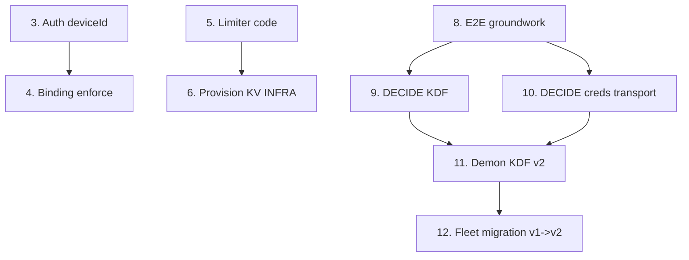

# Implementation Plan

## Overview

Remediacja ustaleń audytu (`audyt_synchronizacji_online_2026-07-01.md`) warstwy
synchronizacji online `__cfab_server`. Legenda: `[x]` zrobione i zweryfikowane
(tsc + lint + testy), `[ ]` pozostałe. Zadania trzymają priorytety audytu
(krytyczne #1–#3 pierwsze) i mapują na wymagania z `requirements.md`.

## Tasks

### WS-A — Walidacja JSON + throttling

- [x] 1. Walidacja strukturalna JSON
  - `src/lib/http/json-guard.ts` (`assertJsonStructure`, iteracyjny obchód), wpięcie w `parseJsonBody`, limity z `env` w `handleSyncPost`.
  - Testy: `json-guard.test.ts` (granice, brak mutacji, hostile depth).
  - _Requirements: 4.1, 4.2, 4.3, 4.4_

- [x] 2. Naprawa martwego throttlingu częstotliwości sync
  - `resolveLicenseContext(userId, deviceId)` czyta realny `DeviceRegistration`; `handleSessionCreate` używa prawdziwego `lastSyncAt`.
  - _Requirements: 5.1, 5.2, 5.3, 5.4_

### WS-B — Związanie deviceId (#3)

- [x] 3. Tożsamość urządzenia w kontekście auth
  - `SyncAuthContext.tokenDeviceId`; `resolveUserByDeviceToken` zwraca `deviceId`.
  - _Requirements: 3.1_

- [x] 4. Egzekwowanie bindingu deviceId
  - `assertDeviceIdBinding` wpięte w `handleSyncPost`/`handleSyncGet`; env-token przezroczysty.
  - Testy: `device-binding.test.ts`. Zamyka forge completion i spoofing ack/credentials.
  - _Requirements: 3.2, 3.3, 3.4, 3.5, 3.6_

### WS-C — Rate limiter + IP

- [x] 5. Współdzielony rate limiter (kod)
  - `rate-limit-store.ts` (in-memory + Upstash/KV REST), `checkRateLimit` async, tryby fail-open/closed; `license/activate` fail-closed.
  - Testy: `rate-limit.test.ts` (zliczanie, reset, oba tryby awarii).
  - _Requirements: 2.1, 2.2, 2.3, 2.4, 2.5, 2.6, 2.7_

- [ ] 6. Provisioning współdzielonego store (INFRA)
  - Utworzyć Vercel KV / Upstash Redis, ustawić `KV_REST_API_URL` / `KV_REST_API_TOKEN` (+ opcjonalnie `RATE_LIMIT_FAILURE_MODE`) w środowisku Vercel.
  - Bez tego działa fallback in-memory (na serverless nieskuteczny globalnie).
  - _Requirements: 2.1_

- [x] 7. Zaufany parsing IP
  - `getClientIp` bierze `x-real-ip` / ostatni (prawy) hop XFF; nigdy lewego wpisu klienta.
  - _Requirements: 6.1, 6.2, 6.3, 6.4_

### WS-D — Realny E2E (#1, #9)

- [x] 8. Prymityw i schemat klucza (serwer, groundwork)
  - `deriveGroupKeyV2` + `isE2eKeyScheme`; kolumny Prisma `keyScheme`/`keySalt` (+ `Group.clientEncryptedStorageConfig`); migracja `20260701000000_e2e_key_scheme`; persystencja `keyScheme` na paczkach; v2 jawnie odrzucany do czasu koordynacji z demonem.
  - Testy: `storage-encryption-v2.test.ts`.
  - _Requirements: 1.1, 1.4, 1.5, 1.6, 1.7_

- [x] 9. DECYZJA: algorytm i miejsce KDF v2 (cross-platform)
  - **Podjęto:** PBKDF2-HMAC-SHA256 (600k, dkLen 32) — parytet WebCrypto/Node/Rust.
    Serwerowy `deriveGroupKeyV2` przełączony ze scrypt na PBKDF2.
  - _Requirements: 1.1_

- [x] 10. Transport kredencjałów w v2 + zdjęcie bramki (za flagą)
  - **Opcja B**: klucz plików client-side; serwer creds bez zmian (v1). Serwer akceptuje
    teraz `keyScheme=v2-passphrase` za flagą `SYNC_ALLOW_E2E_V2` (default false → bez regresji),
    waliduje `keySalt`, utrwala `keyScheme`/`keySalt`. `keyScheme` wystawiany w pending (pole paczki).
    Testy bramki 3/3 (off→odrzuca, on bez keySalt→błąd, zły schemat→błąd). Serwer 90/90.
  - _Requirements: 1.7, 1.8_

- [x] 11. Demon: KDF v2 + passphrase (`__cfab_demon`)
  - [x] 11.1 Parytetowy `deriveGroupDataKeyV2` (WebCrypto PBKDF2, 600k/32B) w
    `dashboard/src/lib/tauri/online-sync.ts` + test golden-vector (parytet z Node/serwerem).
  - [x] 11.2 Model dwóch kluczy w Rust (`online_async_delta.rs` + `config.rs`):
    `data_key_for_scheme` (v1=`encryption_key` do koperty creds; v2=`data_encryption_key`
    do `delta.enc`); PULL wybiera klucz wg `pkg.keyScheme`; PUSH deklaruje `keyScheme`/`keySalt`;
    nowe pola settings `data_encryption_key`/`key_scheme` (default v1). `cargo test`: 145/145.
  - [x] 11.3 Web: pola `data_encryption_key`/`key_scheme` w `DaemonOnlineSyncSettings` + zapis.
    Pola kontraktu + `resolveDaemonDataKey` + `generateGroupPassphrase` (model B) + wspólny
    builder `buildDaemonSettingsPayload` (encryption_key ZAWSZE v1/creds; data key/key_scheme
    z passphrase). Wpięty w obie ścieżki zapisu (`useSyncSettings`/`useSettingsFormState`) +
    pole `groupPassphrase` w web `OnlineSyncSettings`. Testy 14/14, tsc/eslint czyste.
    Inertne (v1) dopóki UI nie ustawi passphrase.
  - [x] 11.4 UI (model B): passphrase w `OnlineSyncLicenseSection.tsx`.
    `PassphraseSection`: Generuj/Generuj-ponownie/Usuń, kod eksportu (`encodeGroupSecret`) +
    Kopiuj, pole importu (`decodeGroupSecret`) z walidacją CRC; props przewleczone
    (`groupPassphrase`/`onGroupPassphraseChange`) przez `OnlineSyncCardProps` → `SettingsSyncTab`
    → `updateOnlineSyncSettings`. Codec `group-secret-codec.ts` (5/5). Klucze i18n en+pl
    (`settings.license.passphrase_*`), lint:locales OK. Dashboard 142/142, tsc/eslint czyste.
    UWAGA: weryfikacja wizualna + e2e (2 urządzenia, `SYNC_ALLOW_E2E_V2=true`) do zrobienia w aplikacji.
  - _Requirements: 1.1, 1.3, 1.4_

- [ ] 12. Migracja floty v1→v2 (fazy 0–3 z design.md)
  ZROBIONE (kod): telemetria zdolności — urządzenia raportują `supportsV2` (mają passphrase)
  przy push/pending; serwer zapisuje `LicenseDevice.supports_v2` (Prisma + migracja
  `20260701010000_device_supports_v2`). Czysta funkcja `computeGroupV2Readiness` + `getGroupKeySchemeStatus`
  (aktywne okno 30 dni, allV2 = wszystkie aktywne v2-capable). Per-grupa auto-akceptacja v2
  (bez globalnej flagi) gdy `allV2`; `SYNC_ALLOW_E2E_V2` = override/kill-switch. Rust: `supportsV2`
  w push/pending. Testy: migration 5/5, async-delta v2 gate/auto-allow, Rust serializacja. Serwer 96, demon 147.
  POZOSTAJE (ops): wdrożenie migracji DB, deprecjacja v1 po telemetryjnym zaniku v1 w oknie 72h,
  weryfikacja e2e na realnej grupie.
  _Requirements: 1.6, 1.7_

### WS-E — Hardening

- [x] 13. Cookie panelu jako podpisana krótkotrwała sesja (#7)
  - `buildDashboardSessionCookieValue` (HMAC, 8h), walidacja stałoczasowa + wygaśnięcie; login nie zapisuje surowego tokenu; `DASHBOARD_SESSION_SECRET`.
  - Testy: `dashboard-session.test.ts`.
  - _Requirements: 7.1_

- [x] 14. CORS respektujący allow-listę (#8)
  - `src/lib/http/cors.ts`; `license/activate` (POST+OPTIONS) bez twardego `*`.
  - _Requirements: 7.2_

- [x] 15. Brak wycieku prismaCode (#10)
  - `mapInfraError` loguje kod serwerowo, nie zwraca `details.prismaCode`.
  - _Requirements: 7.3_

- [x] 16. Marker mismatch → failed (#11)
  - Krok 12: rozbieżny marker ustawia `status=failed`, `errorMessage="marker_mismatch"`.
  - _Requirements: 7.4_

- [x] 17. Admin-auth stałoczasowe bez gałęzi długości (#12)
  - `constantTimeEqual` (SHA-256 → `timingSafeEqual`).
  - _Requirements: 7.5_

### WS-F — Poprawność dedup delta

- [x] 18. Dedup `assignment_feedback` / `assignment_auto_runs`
  - Klucz tożsamości: `uuid`/`id`, fallback pełny klucz + skrót treści; koniec z gubieniem rekordów równoczasowych.
  - _Requirements: 8.1, 8.2, 8.3_

## Task Dependency Graph

```json
{
  "waves": [
    {
      "wave": 1,
      "tasks": ["1", "2", "3", "5", "7", "8", "13", "14", "15", "16", "17", "18"],
      "description": "Niezależne prace serwerowe (ukończone) — brak zależności blokujących."
    },
    {
      "wave": 2,
      "tasks": ["4", "6", "9", "10"],
      "description": "4 zależy od 3; 6 od infrastruktury (KV); 9 i 10 to decyzje architektoniczne zależne od groundworku (8)."
    },
    {
      "wave": 3,
      "tasks": ["11"],
      "description": "Implementacja v2 w demonie — zależy od decyzji 9 i 10."
    },
    {
      "wave": 4,
      "tasks": ["12"],
      "description": "Migracja floty v1→v2 — zależy od 11."
    }
  ]
}
```



Zadania ukończone (1–5, 7, 8, 13–18) nie mają zależności blokujących. Pozostałe:
- **6** zależy tylko od infrastruktury (KV) — niezależne od kodu.
- **9** i **10** to decyzje architektoniczne blokujące **11**; **11** blokuje **12**.

## Notes

- **Blokada v2 (zad. 9/10):** WebCrypto nie ma scrypt (web-warstwa demona), więc
  wybór KDF musi być cross-platform (Rust-only scrypt lub PBKDF2 wszędzie). Serwer
  nie zna passphrase, więc transport creds w v2 wymaga przeprojektowania (Opcja B/C).
  Do czasu decyzji serwer odrzuca `keyScheme=v2-passphrase` (`key_scheme_not_supported_yet`).
- **Migracja Prisma:** `20260701000000_e2e_key_scheme` jest addytywna (defaulty → v1);
  wdroży się przez `build` (`prisma migrate deploy`). Nie uruchamiano na produkcyjnym DB.
- **Stan testów:** 87 przechodzi (było 60 przed remediacją). Nowe pliki testów:
  `json-guard`, `device-binding`, `rate-limit`, `dashboard-session`, `storage-encryption-v2`.
- **Dług lintowy (poza zakresem):** `src/lib/sync/__tests__/async-delta.test.ts` ma
  10 istniejących błędów `no-explicit-any` — nietknięte przez remediację.
